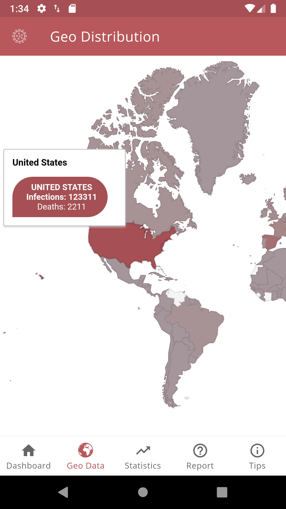

# corona-app
This app tracks cases of corona virus infections in realtime accross the world using data from http://thevirustracker.com/

## Getting Started

You need to create a maps key from the google console and enable maps for java script and android.

### Prerequisites
```Java 8```
```Android SDK```
```Kotlin```

### Installing

```
./gradlew installDebug
```

### Sreenshots



